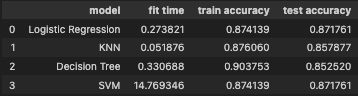
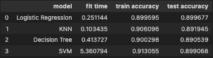
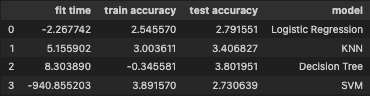

# Overview
In this practical application, your goal is to compare the performance of the classifiers we encountered in this section, namely K Nearest Neighbor, Logistic Regression, Decision Trees, and Support Vector Machines.  We will utilize a dataset related to marketing bank products over the telephone. 

Data: https://archive.ics.uci.edu/dataset/222/bank+marketing

## Business Objective
The business objective is to optimize the bank's marketing campaigns by accurately predicting which clients are likely to subscribe to term deposits. This will increase conversion, improve customer targeting and reduce operational costs.

# Data
The data is related with direct marketing campaigns of a Portuguese banking institution. The marketing campaigns were based on phone calls. Often, more than one contact to the same client was required, in order to assess if the product (bank term deposit) would be ('yes') or not ('no') subscribed.

# Classification Models

## Base Models

After cleaning the data, removing unknown values, and encoding needed binary columns, the data was fed into a sk learn pipeline where catagorical features were OneHotEncoded and numeric data was scaled appropriatly. Each of the 4 models were created with their default parameters to get a baseline model score. The below table shows the performance of each.

Below are some observations:

- KNN had the fastest fit time of 0.050876 seconds and SVM had the longest fit time of 14.769346 seconds, which is ~ 300 time longer than KNN.

- Logistic Regression and SVM had the best testing accuracy of 87.1761% and the Decision Tree performed the worst with a testing accurcy of 85.2520%

- Decision Tree had the hightest training accuracy of 90.3753% and Logistic Regression and SVM had the lowest training accuracy of 87.4139%.

## Tuned Models

After some additional feature engineering, deminsionality reduction using PCA, and hyperparameter tuning, the models improved on their fit time and accuracy. The below table shows the performances of each after tuning.

Logistic Regression
- Best parameters for Logistic Regression: {'classifier__C': 0.1, 'classifier__solver': 'newton-cg'}
- After tuning, Logistic regression decreased fit time by 2.26s, increased training accuracy by 2.54% and increased testing accuracy by 2.79% for a final testing accuracy of 89.9677% 

KNN
- Best parameters for KNN: {'classifier__n_neighbors': 10}
- After tuning, KNN's fit time increased by 5 seconds but significantly improved but testing and training accuracy.

Decision Tree
- Best parameters for Decision Tree: {'classifier__max_depth': 5}
- After tuning, fit time increased, training accuracy decreased but testing accuracy increased.

SVM
- Best parameters for SVM: {'classifier__C': 1, 'classifier__kernel': 'rbf'}
- After tuning, fit time significantly decreased, and both training accuracy and testing accuracy improved.

Model Performance Deltas

The model with the best testing accuracy ended up being Logistic Regression with a testing accuracy of 89.9677%, closely followed by SVM with 89.9068% accuracy, which is very close.

# Conclusion

An insight from the logistic regression model is that those with a blue collar or entrepreneur job were more likely to not subscribe. Those that had no education, retired, or were a student were more likely to subscribe.

The best predictive model from the data is a close call between Logictic Regression and SVM in terms of accuracy, but overall Logistic Regression wins with its smaller fit time.

# Next Steps
- Additional data would always be of use, allowing for more feature engineering
- Furthur tuning to dive deeper into Logistic Regression and SVM. 
- Implement cross validation techniques to improve model estimates
- Experiment with more regularization techniques
- Consult some domain experts to get advice on data and any recommendations they may have. 